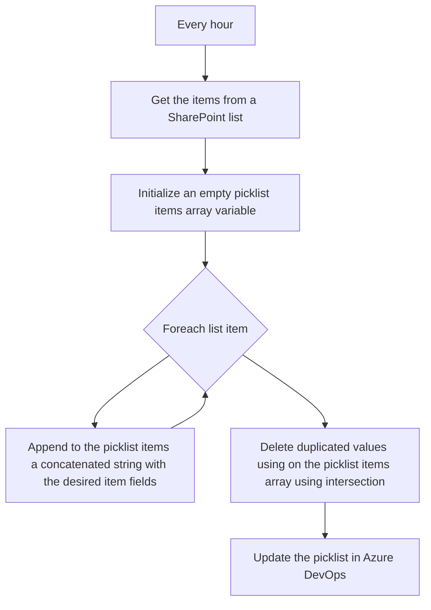

# Summary

Updating an Azure DevOps Workitem Picklist allowed values from a SharePoint list.

# The background

For a couple of years I received many requests regarding an specific feature of Azure DevOps: WorkItems tracking. Azure DevOps has a very flexible and powerful (maybe too much) work items tracking platform in what is called now Azure DevOps Boards. Our organization used Azure DevOps Boards in a very peculiar way, it was not only our project management but also our CRM, ERP and time tracking tool. This required some very "clever" extensions and implementations. One of them is the ability to update an Azure DevOps Workitem Picklist with a set of allowed values that came from different sources, easier to manage and collaborate for multiple users, like SharePoint lists. We did custom code (Azure Functions), Power Platform apps, and database connectors to achieve this. Last week I was asked the same thing, and this time I am trying to solve the problem with my favorite low-code/no-code solution.

# The flow

# The logicapp

1. Deploy a new Logic App to Azure using the following template:

2. Then open your Logic App, go to `API connections`, open **every** connection, go to `Edit API connection`, Authorize **and Save**.
3. Open the `Logic app designer` under Developer Tools:
  * Edit the `Get items` step, and update a `Site address` and `List name`.
  * (Optional) Edit the step `Append to array variable` and update the value that you want to show in the picklist.
  * Edit the `Send an HTTP request to Azure DevOps` step and update the `Organization Name`.
  * Inside the designer open the `[@] Parameters` panel, and provide the picklist id.
4. Save and test.

# How to get the picklist id

Replace `myorganization` and `myfieldname` in the following url and retrieve the `picklistId` property: [https://dev.azure.com/myorganization/_apis/wit/fields/myfieldname?api-version=6.0-preview.2&$expand=ALL](https://dev.azure.com/myorganization/_apis/wit/fields/myfieldname?api-version=6.0-preview.2&$expand=ALL)

You can beautify the json result with some extension like [Seven JSON Viewer](https://microsoftedge.microsoft.com/addons/detail/seven-json-viewer/khfhokalnpdlmmfjocjgaaipenplemjo?hl=en-US).
