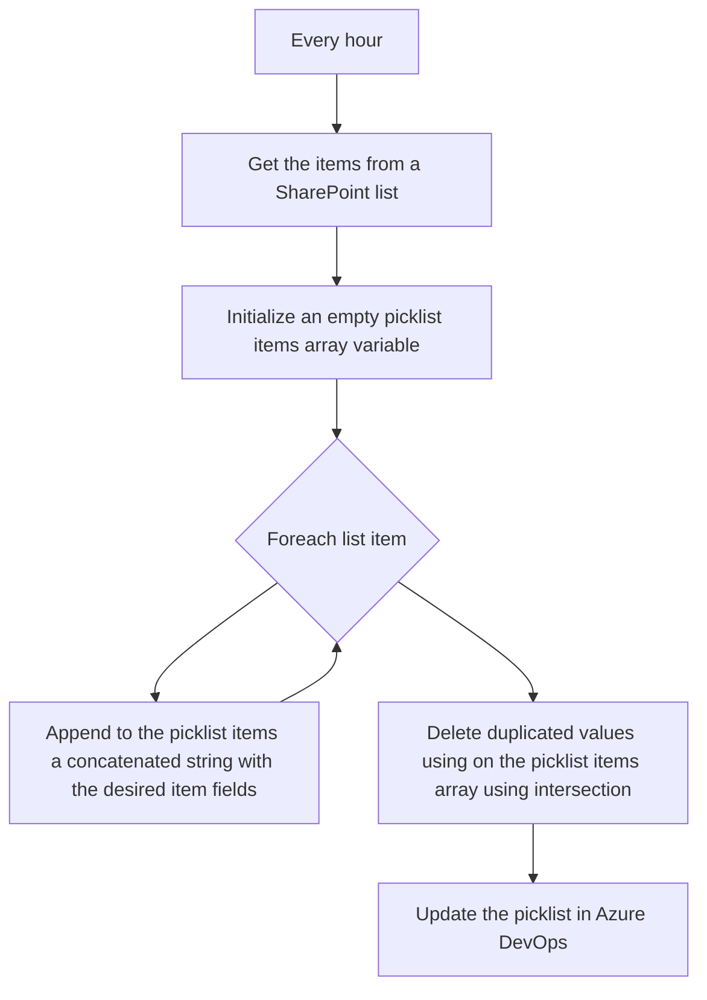

# Summary

Updating an Azure DevOps Workitem Picklist allowed values from a SharePoint list.

# The background

For a couple of years I was the go-to folk regarding a specific feature of Azure DevOps: WorkItems tracking. Azure DevOps has a very flexible and powerful (maybe too much) work items tracking platform in what is called now Azure DevOps Boards. Our organization used Azure DevOps Boards in a very peculiar way, it was not only our project management but also our CRM, ERP and time tracking tool. This required some very "clever" extensions and implementations. One of them is the ability to update an Azure DevOps Workitem Picklist with a set of allowed values that came from different sources, like SharePoint lists. We did custom code (Azure Functions), Power Platform apps, and database connectors to achieve this. Just last week I was asked the same thing, this time I am trying to solve the problem with my favorite low-code/no-code solution.

# The flow

# The logicapp

- [main.workflow.json](main.workflow.json)

